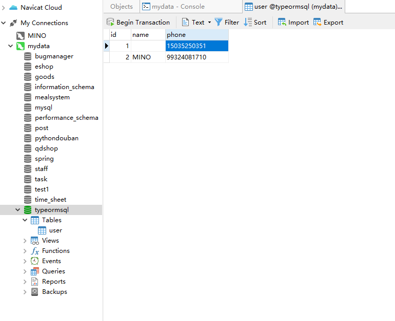

# Awesome Project Build with TypeORM

Steps to run this project:

1. Run `npm i` command
2. Setup database settings inside `ormconfig.json` file
3. Run `npm start` command

# typeorm

TypeORM 是一个ORM (opens new window)框架，它可以运行在 NodeJS、Browser、Cordova、PhoneGap、Ionic、React Native、Expo 和 Electron 平台上，可以与 TypeScript 和 JavaScript (ES5,ES6,ES7,ES8)一起使用。 它的目标是始终支持最新的 JavaScript 特性并提供额外的特性以帮助你开发任何使用数据库的（不管是只有几张表的小型应用还是拥有多数据库的大型企业应用）应用程序。

# Quick Start

## 初始化项目

1. npm i typeorm -g
2. typeorm init --name MyProject --database mysql --express

## 数据库

1. 创建database: typeormsql

